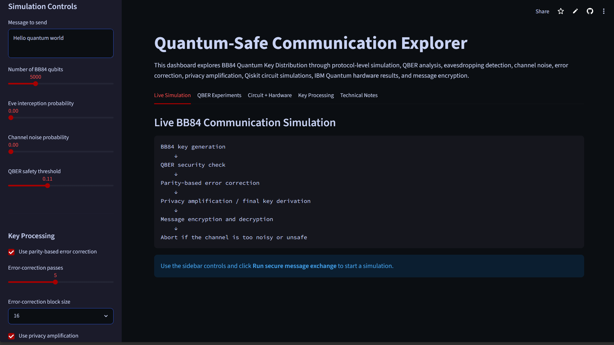

# Quantum-Safe Communication Explorer

Quantum-Safe Communication Explorer is a simulation and visualization project for studying BB84 Quantum Key Distribution, eavesdropping detection, QBER analysis, error correction, privacy amplification, channel noise, Qiskit circuit simulation, IBM Quantum hardware behavior, and message encryption using quantum-generated keys.

The project combines protocol-level BB84 simulation, Qiskit circuit demonstrations, Qiskit Aer noise models, IBM Quantum hardware experiments, repeated QBER experiments, and an interactive Streamlit dashboard to show how quantum information principles can support secure communication.

## Live Demo

Try the interactive dashboard here:

[Launch Quantum-Safe Communication Explorer](https://quantum-safe-communication-explorer.streamlit.app/)

## Main Features

### Protocol Simulation
- BB84 Quantum Key Distribution simulation
- Eve intercept-resend attack model
- Channel noise simulation
- QBER analysis and visualization

### Key Processing
- Parity-based error correction
- Privacy amplification using SHAKE-256 based final key derivation
- Message encryption using BB84-generated keys
- Error correction and privacy amplification parameter sweeps

### Quantum Circuit and Hardware Experiments
- Qiskit circuit-based BB84 demonstration
- Qiskit Aer noise model experiment
- IBM Quantum hardware demonstration

### Interface and Documentation
- Streamlit interactive dashboard
- Organized dashboard experiment tabs
- Research-style project report
- Final results summary

## Project Architecture

```text
User Input
   ↓
Streamlit Dashboard
   ↓
BB84 Protocol Simulator
   ↓
Eve Attack Model + Channel Noise Model
   ↓
QBER Calculation
   ↓
Parity-Based Error Correction
   ↓
Privacy Amplification / Final Key Derivation
   ↓
Message Encryption and Decryption
   ↓
Results, Graphs, and Dashboard Outputs
```

## Quantum Circuit and Hardware Layer

```text
BB84 Circuit Construction
   ↓
Ideal Qiskit Simulation
   ↓
Qiskit Aer Noisy Simulation
   ↓
IBM Quantum Hardware Run
   ↓
Circuit-Level Result Comparison
```

## Dashboard Preview



## How to Run

Install dependencies:

```bash
pip install -r requirements.txt
```

Run the dashboard:

```bash
streamlit run app.py
```

Run notebooks:

```bash
jupyter notebook
```

## IBM Quantum Hardware Setup

The IBM hardware notebook requires an IBM Quantum API key saved locally. Do not commit your API key to GitHub.

Save your account locally once using:

```python
from qiskit_ibm_runtime import QiskitRuntimeService

QiskitRuntimeService.save_account(
    channel="ibm_quantum_platform",
    token="PASTE_YOUR_API_KEY_HERE",
    overwrite=True,
    set_as_default=True
)
```

After that, the IBM hardware notebook can load the saved account automatically.

## Project Status

Current version: **v2.0**

The project currently supports BB84 simulation, Eve attack modeling, QBER experiments, parity-based error correction, privacy amplification, channel noise simulation, Eve-vs-noise comparison experiments, Qiskit circuit demonstrations, Qiskit Aer noise modeling, IBM Quantum hardware experiments, error correction parameter sweeps, privacy amplification parameter sweeps, message encryption, project documentation, and a live deployed dashboard.

## Repository Structure

```text
quantum-safe-communication-explorer/
│
├── app.py
├── README.md
├── requirements.txt
│
├── src/
│   ├── bb84.py
│   ├── encryption.py
│   ├── error_correction.py
│   ├── error_correction_experiments.py
│   ├── experiments.py
│   ├── ibm_hardware.py
│   ├── privacy_amplification.py
│   ├── privacy_amplification_experiments.py
│   ├── qiskit_bb84.py
│   └── qiskit_noise.py
│
├── notebooks/
│   ├── 01_bb84_basics.ipynb
│   ├── 02_eve_attack_simulation.ipynb
│   ├── 03_qber_experiments.ipynb
│   ├── 04_message_encryption.ipynb
│   ├── 05_qiskit_bb84_demo.ipynb
│   ├── 06_error_correction_demo.ipynb
│   ├── 07_privacy_amplification_demo.ipynb
│   ├── 08_channel_noise_demo.ipynb
│   ├── 09_eve_noise_comparison.ipynb
│   ├── 10_qiskit_noise_models.ipynb
│   ├── 11_ibm_hardware_demo.ipynb
│   ├── 12_error_correction_parameter_sweep.ipynb
│   └── 13_privacy_amplification_parameter_sweep.ipynb
│
├── figures/
├── results/
└── docs/
    ├── final_results_summary.md
    └── project_report.md
```

## Technical Pipeline

The current communication pipeline is:

```text
BB84 key generation
→ QBER security check
→ parity-based error correction
→ privacy amplification
→ final key derivation
→ message encryption/decryption
```

The project also includes experiments that study how QBER changes under:

* increasing Eve interception probability
* increasing channel noise probability
* clean, noise-only, Eve-only, and Eve-plus-noise scenarios
* ideal vs noisy Qiskit circuit simulation
* selected BB84 circuit behavior on IBM Quantum hardware

## Key Results

### 1. Eve Interception Increases QBER

The intercept-resend attack introduces errors because Eve does not always measure in the same basis as Alice. The simulated QBER follows the expected approximate relationship:

```text
QBER ≈ Eve interception probability × 25%
```

### 2. Qiskit Confirms the BB84 Basis Rule

The Qiskit circuit demonstration confirms the core BB84 behavior:

```text
same basis → Bob recovers Alice's bit
different basis → Bob gets an approximately random result
```

### 3. Error Correction Is Needed Before Encryption

When QBER is low but nonzero, Alice and Bob may still have mismatched sifted keys. The parity-based correction step reduces these mismatches before the key is used.

### 4. Privacy Amplification Derives the Final Key

After correction, the reconciled key is compressed using a SHAKE-256 based derivation step. The derived final key is then used for message encryption.

### 5. QBER Can Come From Eve, Noise, or Both

The Eve-vs-noise comparison experiment shows that QBER can increase because of eavesdropping, channel noise, or a combination of both. This makes the simulator useful for studying both attack behavior and noisy transmission conditions.

### 6. Qiskit Aer Connects Protocol Noise to Circuit Noise

The Qiskit Aer noise experiment compares ideal BB84 circuits with noisy circuit simulations. This connects the earlier protocol-level noise model to circuit-level quantum simulation with gate and readout errors.

### 7. IBM Quantum Hardware Shows Real Device Behavior

The IBM Quantum hardware demonstration runs selected BB84 circuits on real quantum hardware. Same-basis circuits should mostly recover Alice's bit, while different-basis circuits should be closer to random. Real-device noise can cause deviations from ideal simulation.

### 8. Error Correction Has a Reliability-Cost Tradeoff

The error correction parameter sweep shows how block size and correction passes affect correction success rate and parity-check cost. More passes can improve reliability, but they also require more parity checks.

### 9. Privacy Amplification Has a Compression-Capacity Tradeoff

The privacy amplification parameter sweep shows how compression ratio affects usable final key length and message transmission success. Stronger compression reduces the amount of final key material available for encryption, while weaker compression preserves more usable key length.

## Output Files

Important generated outputs include:

```text
results/qber_experiment_results.csv
results/channel_noise_experiment_results.csv
results/eve_noise_comparison_results.csv
results/qiskit_bb84_basis_results.csv
results/qiskit_noise_results.csv
results/ibm_hardware_results.csv
results/error_correction_parameter_sweep.csv
results/privacy_amplification_parameter_sweep.csv

figures/qber_vs_eve_interception.png
figures/qber_vs_channel_noise.png
figures/eve_noise_comparison_qber.png
figures/qiskit_bb84_basis_results.png
figures/qiskit_noise_comparison.png
figures/ibm_hardware_comparison.png
figures/error_correction_success_rate.png
figures/error_correction_parity_checks.png
figures/privacy_amplification_success_rate.png
figures/privacy_amplification_key_capacity.png

docs/project_report.md
docs/final_results_summary.md
```

## Version History

* v0.1: Implemented BB84 without eavesdropping
* v0.2: Added Eve intercept-resend attack simulation
* v0.3: Added QBER experiment and visualization
* v0.3.1: Fixed typo in QBER graph label
* v0.4: Added message encryption using the BB84-generated key
* v0.5: Added Streamlit interactive dashboard
* v0.6: Added Qiskit circuit-based BB84 demonstration
* v0.7: Added project report and improved README readability
* v0.8: Deployed the Streamlit dashboard and added live demo link
* v0.9: Added parity-based error correction
* v1.0: Added privacy amplification and final key derivation
* v1.1: Added channel noise simulation and QBER analysis
* v1.2: Added Eve vs channel noise comparison experiment
* v1.3: Refreshed README and project report for the full v1.2 pipeline
* v1.4: Added Qiskit Aer noise model experiment
* v1.5: Added IBM Quantum hardware demonstration
* v1.6: Added error correction parameter sweep
* v1.7: Added privacy amplification parameter sweep
* v1.8: Organized dashboard and added final results summary
* v1.8.1: Restored populated notebooks
* v2.0: Final polished release of the BB84 simulation and analysis platform

## Version 2.0: Complete BB84 Simulation and Analysis Platform

This release finalizes the Quantum-Safe Communication Explorer as a complete BB84 simulation and analysis platform.

### Final Updates

- Verified populated notebooks
- Verified generated result CSV files
- Verified generated figures
- Cleaned and organized Streamlit dashboard
- Updated final results summary
- Updated project report
- Updated README for the full pipeline
- Verified live demo deployment

### Current Capabilities

- BB84 key generation simulation
- Eve intercept-resend attack modeling
- QBER experiments
- Channel noise simulation
- Eve vs noise comparison
- Qiskit circuit validation
- Qiskit Aer noisy simulation
- IBM Quantum hardware demonstration
- Parity-based error correction
- Privacy amplification
- Message encryption and decryption
- Interactive Streamlit dashboard

### Key Result

The project now demonstrates a full BB84-inspired communication pipeline from quantum key generation to encrypted message transmission, while also analyzing eavesdropping, noise, circuit-level behavior, hardware behavior, error correction, and privacy amplification.

### Future Work

Possible future extensions include E91 entanglement-based QKD, expanded attack models, stronger reconciliation protocols, additional IBM Quantum hardware runs, and public technical articles explaining the project.