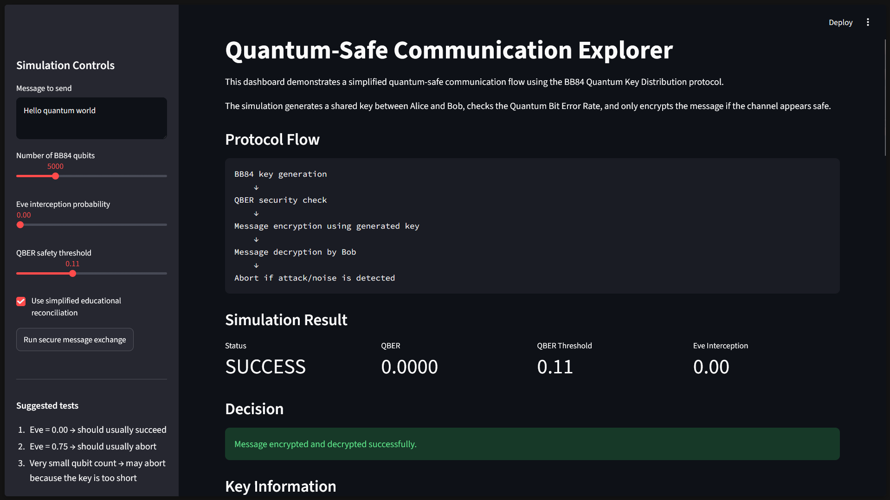

# Quantum-Safe Communication Explorer

Quantum-Safe Communication Explorer is an educational simulation platform for exploring BB84 Quantum Key Distribution, eavesdropping detection, QBER analysis, and message encryption using quantum-generated keys.

The project combines protocol-level simulation, interactive visualization, and Qiskit-based quantum circuit demonstrations to show how quantum information principles can support secure communication.

## Live Demo

Try the interactive dashboard here:

[Launch Quantum-Safe Communication Explorer](https://quantum-safe-communication-explorer.streamlit.app/)

## Main Features

- BB84 Quantum Key Distribution simulation
- Eve intercept-resend attack model
- QBER experiment and visualization
- Message encryption using BB84-generated keys
- Simplified educational key reconciliation
- Streamlit interactive dashboard
- Qiskit circuit-based BB84 demonstration
- Research-style documentation

## Project Architecture

User Input

 ↓

Streamlit Dashboard

   ↓

BB84 Simulator

   ↓

Eve Attack Model

   ↓

QBER Calculation

   ↓

Simplified Reconciliation

   ↓

Message Encryption / Decryption

   ↓
   
Results + Visualizations

## Dashboard Preview



## How to Run

Install dependencies:

```bash
pip install -r requirements.txt
```

Run the dashboard:

```bash
streamlit run app.py
```

Run notebooks:

```bash
jupyter notebook
```

## Project Status

Current version: v1.1

The project currently supports BB84 simulation, Eve attack modeling, QBER experiments, SHA256 encryption, parity-based error correction, privacy aplification, channel noise simulation, interactive dashboard usage, Qiskit circuit demonstrations, documentation, and a live deployed dashboard.

## Version History

- v0.1: Implemented BB84 without eavesdropping
- v0.2: Added Eve intercept-resend attack simulation
- v0.3: Added QBER experiment and visualization
- v0.3.1: Fixed typo in QBER graph label
- v0.4: Implemented Message Encryption using the BB84 key
- v0.5: Added Streamlit interactive dashboard
- v0.6: Added Qiskit circuit-based BB84 demonstration
- v0.7: Added project report and improved README readability
- v0.8: Deployed the Streamlit dashboard and added live demo link
- v0.9: Added parity-based error correction
- v1.0: Added privacy amplification and final key derivation
- v1.1: Added channel noise simulation and QBER analysis

## Version 0.1: BB84 Without Eavesdropping

This project simulates the BB84 Quantum Key Distribution protocol to explore quantum-safe communication.

The first vesrsion simulates BB84 without eavesdropping. Alice generates random bits and bases, Bob generates random bases and both of them only keep positions where their bases match. This allowes them to produce a shared key.

### Features

- Random bit generation
- Random basis generation using Z and X bases
- Bob measurement simulation
- Key sifting
- QBER calculation
- BB84 simulation without Eve

### Initial Observation:
When there is no eavesdropper, Alice and Bob generate matching sifted keys and the QBER is 0. 

### Next Step 
The next version will introduce Eve using an intercept-resend attack and measure how eavesdropping increases the Quantum Bit Error Rate. 

## Version 0.2: Eve Intercept-Resend Attack Simulation

This version adds an eavesdropping model to the BB84 simulation. 

In BB84, Alice sends qubits using randomly chosen bases, while Bob independently chooses his own measurement bases. In this version, an eavesdropper named Eve can intercept a percentage of the transmitted qubits. Even randomly chooses a basis, measures the qubit, and resends her measured result to Bob. 

Because Eve does not always choose the correct basis, her measurement can disturb the transmitted state. This disturbance appears as errors in Alice and Bob’s sifted keys.

### New Features
- Added Eve as an intercept-resend attacker
- Added configurable Eve interception probability
- Simulated Eve’s random basis choices
- Simulated Bob’s measurement after Eve resends qubits
- Calculated QBER after eavesdropping
- Tested the protocol with different interception probabilities

### Key Observation
When Eve intercepts qubits, the Quantum Bit Error Rate increases. For an intercept-resend attack, the expected QBER is approximately:

```text
QBER ≈ Eve interception probability x 25%
```

For example, if Eve intercepts 25% of the qubits, the expected QBER is roughly:

```text
0.25 x 0.25 = 0.0625
```

or about 6.25%

### Next Step

The next version will run the simulation across multiple Eve interception probabilities and generate a graph showing how QBER changes as Eve's attack strength increases. 

## Version 0.3: QBER Experiment and Visualization

This version extends the Eve intercept-resend simulation by running BB84 across multiple Eve interception probabilities and measuring how the Quantum Bit Error Rate changes.

Instead of testing only one attack level, the experiment now evaluates Eve interception rates from 0% to 100%. For each interception rate, the simulation is repeated multiple times, and the average QBER is calculated.

### New Features

* Added repeated QBER experiments across multiple Eve interception rates
* Added average QBER calculation
* Added QBER standard deviation calculation
* Added expected QBER comparison
* Saved experiment results as a CSV file
* Generated a QBER vs Eve interception probability graph

### Key Result

The simulation confirms the expected BB84 behavior:

```text
QBER ≈ Eve interception probability × 25%
```

As Eve intercepts more qubits, the QBER increases. This demonstrates how BB84 can statistically detect eavesdropping through disturbance in the quantum channel.

### Output Files

```text
results/qber_experiment_results.csv
figures/qber_vs_eve_interception.png
```

### Next Step

The next version will use the sifted BB84 key to encrypt and decrypt a message, connecting quantum key distribution to practical secure communication.

## Version 0.4: Message Encryption Using the BB84 Key

This version connects the BB84 key generation simulation to a simple secure communication demo.

After Alice and Bob generate sifted keys through BB84, the system checks the Quantum Bit Error Rate. If the QBER is above the safety threshold, communication is aborted because possible eavesdropping has been detected. If the QBER is acceptable and Alice and Bob's keys match, the generated key is used to encrypt and decrypt a message.

### New Features

- Added message-to-bits conversion
- Added bits-to-message conversion
- Added XOR-based educational encryption
- Added decryption using Bob's BB84-generated key
- Added QBER threshold decision logic
- Added automatic communication abort if QBER is too high
- Added automatic abort if the generated key is too short
- Added automatic abort if Alice and Bob's keys do not match exactly
- Added message encryption notebook

### Security Note

This version uses XOR encryption as an educational one-time-pad style demonstration. It is not production cryptography.

This version also does not implement BB84 error correction or privacy amplification. If Alice and Bob's generated keys do not match exactly, communication is aborted. A future version may add simplified error reconciliation and privacy amplification.

The simplified reconciliation step removes mismatched key positions using simulation-only access. This is included to demonstrate why BB84 needs error correction. It is not a production error-correction protocol. Real BB84 systems require authenticated public discussion, error correction, and privacy amplification.

### Key Result

The project now demonstrates the full basic flow of quantum-safe communication:

```text
BB84 key generation
→ QBER security check
→ message encryption
→ message decryption
→ abort if attack/noise is detected
```

## Version 0.5: Streamlit Interactive Dashboard

This version adds an interactive Streamlit dashboard for the quantum-safe communication simulation.

Users can now adjust the number of BB84 qubits, Eve's interception probability, the QBER safety threshold, and the message to be transmitted. The dashboard runs the BB84 simulation, checks the QBER, and either encrypts/decrypts the message or aborts communication if the channel appears unsafe.

### New Features

- Added Streamlit dashboard
- Added interactive message input
- Added slider for number of BB84 qubits
- Added slider for Eve interception probability
- Added slider for QBER safety threshold
- Added visual status display for successful or aborted communication
- Added QBER, key length, and message bit metrics
- Added ciphertext and decrypted message display
- Added QBER experiment graph display
- Added educational security note
- Added simplified educational key reconciliation
- Added option to enable or disable reconciliation in the dashboard
- Added display for raw key length, final key length, and removed mismatched bits
- Added explanation that real BB84 requires error correction and privacy amplification

### How to Run the Dashboard

```bash
streamlit run app.py
```

### Key Result
The project can now be explored interactively. Users can observe how increasing Eve's interception probability increases the likelihood of communication being aborted due to excessive QBER.

### Output Files
```text
app.py
```

### Next Step
The next version may add a simplified error correction module, a Qiskit-based circuit demonstration, or a polished project report.

## Version 0.6: Qiskit Circuit-Based BB84 Demo

This version adds a Qiskit-based quantum circuit demonstration of the BB84 protocol.

Earlier versions simulated BB84 at the protocol level using the rule that matching bases produce the correct bit and mismatched bases produce a random bit. This version shows how that behavior appears from actual one-qubit quantum circuits.

### New Features

- Added Qiskit-based BB84 circuit construction
- Added circuit preparation for |0>, |1>, |+>, and |-> states
- Added Bob's Z-basis and X-basis measurement logic
- Added repeated circuit simulations using Qiskit Aer
- Added comparison of same-basis and different-basis measurements
- Added result table for all BB84 basis cases
- Added visualization of measurement probabilities

### Key Result

The Qiskit simulation confirms the rule used in the earlier BB84 simulator:

```text
same basis → Bob recovers Alice's bit
different basis → Bob gets an approximately random result
```

This connects the project’s protocol-level BB84 simulation to real quantum circuit behavior.

### Output Files

src/qiskit_bb84.py
notebooks/05_qiskit_bb84_demo.ipynb
results/qiskit_bb84_basis_results.csv
figures/qiskit_bb84_basis_results.png

### Next Step

The next version may add a project report, a Qiskit section to the dashboard, or simplified error correction and privacy amplification.

## Version 0.7: Research Report and Documentation

This version improves the project’s presentation and documentation.

### New Features

- Added research-style project report
- Added project architecture explanation
- Added dashboard screenshot
- Improved README introduction
- Added clearer project status section
- Added limitations and future work discussion

### Output Files

- docs/project_report.md
- figures/dashboard_v0_5.png

### Next Step

The next version may add deployment, simplified error correction, privacy amplification, or a blog series explaining the project.

## Version 0.8: Deployed Interactive Dashboard

This version deploys the Streamlit dashboard publicly so the project can be explored through a live web app.

### New Features

- Deployed the Streamlit dashboard online
- Added live demo link to README
- Tested dashboard behavior in a hosted environment
- Made the project easier to access

### Key Result

The project is now publicly accessible through a live interactive dashboard. Users can adjust Eve's interception probability, QBER threshold, number of qubits, and message input to observe how BB84-based secure communication behaves under different conditions.

### Next Step

The next version may add simplified error correction, privacy amplification, or a technical blog series explaining the project.

## Version 0.9: Parity-Based Error Correction

This version replaces the earlier direct mismatch-removal reconciliation with a more meaningful error-correction step.

After BB84 key generation, Alice and Bob's sifted keys may still contain mismatched bits when QBER is low but nonzero. This version uses parity-based block checks to locate and correct likely errors in Bob's key before message encryption.

### New Features

- Added parity-based error correction
- Added block parity comparison
- Added binary parity search for likely error locations
- Added multiple shuffled correction passes
- Added final mismatch tracking
- Added correction metrics to the Streamlit dashboard
- Added error-correction controls to the dashboard
- Added error-correction demonstration notebook

### Key Result

The project now demonstrates why BB84 requires a reconciliation step. When Eve's interception is low enough that QBER remains below the threshold, Alice and Bob may still have mismatched raw keys. Error correction can reduce or eliminate these mismatches before encryption.

### Output Files

- src/error_correction.py
- notebooks/06_error_correction_demo.ipynb

### Next Step

The next version may add privacy amplification, which compresses the reconciled key to reduce any information Eve may have gained during transmission and public reconciliation.

## Version 1.0: Privacy Amplification and Final Key Derivation

This version adds a final key derivation step after BB84 key generation and parity-based correction.

After Alice and Bob generate sifted keys and correct mismatches, the reconciled key is compressed into a shorter final key using a hash-based privacy amplification step. The final key is then used for message encryption and decryption.

### New Features

- Added privacy amplification module
- Added SHAKE-256 based final key derivation
- Added privacy compression ratio control
- Added final key fingerprint display
- Updated dashboard key-processing metrics
- Added privacy amplification notebook
- Reduced repeated warning text in the dashboard

### Key Result

The project now follows a more complete BB84-inspired communication pipeline:

BB84 key generation → QBER check → error correction → privacy amplification → message encryption

### Output Files

- src/privacy_amplification.py
- notebooks/07_privacy_amplification_demo.ipynb

### Next Step

The next version may add channel noise simulation or a project write-up/blog series.

## Version 1.1: Channel Noise Simulation

This version adds channel noise simulation to the BB84 communication pipeline.

Earlier versions modeled errors mainly through Eve's intercept-resend attack. This version adds a separate channel noise probability, allowing the project to compare errors caused by eavesdropping with errors caused by normal transmission noise.

### New Features

- Added simple bit-flip channel noise model
- Added channel noise probability to BB84 simulation
- Added channel noise control to the Streamlit dashboard
- Added channel noise QBER experiment
- Added channel noise visualization
- Added channel noise result CSV

### Key Result

The project can now model QBER from two sources:

```text
Eve interception
+
channel noise
→ QBER
```

This makes the simulator more realistic and allows users to test how the protocol behaves under clean, noisy, attacked, and combined conditions.

## Output Files

- notebooks/08_channel_noise_demo.ipynb
- results/channel_noise_experiment_results.csv
- figures/qber_vs_channel_noise.png

## Next Step

The next version may add comparison experiments between Eve-only, noise-only, and Eve-plus-noise scenarios.